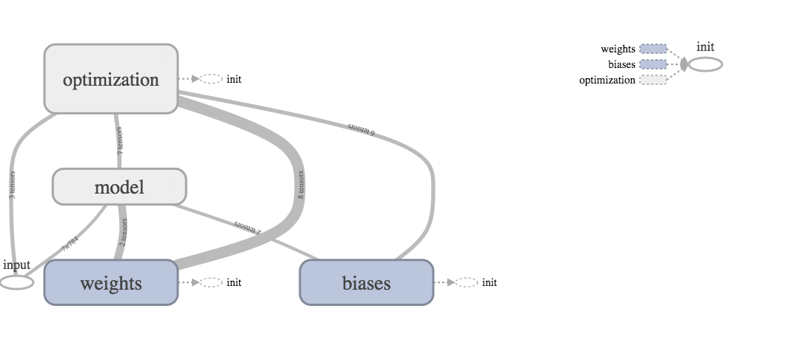

# Autoencoder
Finished notebooks:
* [MNIST Autoencoder](https://github.com/chen10an/ml_algos_python/blob/master/autoencoder/MNIST%20Autoencoder.ipynb)

Working on:
* [CIFAR-10 Autoencoder](https://github.com/chen10an/ml_algos_python/blob/master/autoencoder/CIFAR-10%20Autoencoder.ipynb)

I have created main.py, model.py and utils.py based on the finished notebooks so
that it is possible to run the autoencoder as a script (main.py).

Tensorboard Graph:  

Learning about autoencoders:
* http://ufldl.stanford.edu/tutorial/unsupervised/Autoencoders/
* http://www.deeplearningbook.org/contents/autoencoders.html
