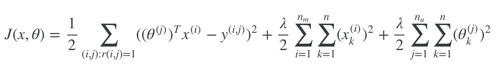

# Collaborative Filtering
Finished notebook: [Collaborative Filtering for Movie Ratings](https://github.com/chen10an/ml_algos_python/blob/master/collaborative_filtering/Collaborative%20Filtering%20for%20Movie%20Ratings.ipynb)

This notebook's implementation of collaborative filtering is based on Andrew Ng's
lectures and assignments from [Coursera][coursera]. The data used here is also from
Andrew's course. In addition to the notebook, I've created three python files
(main.py, user.py, utils.py) to make it possible to run the algorithm as a script (main.py).

Cost function:  

[coursera]: https://www.coursera.org/learn/machine-learning/home/welcome
